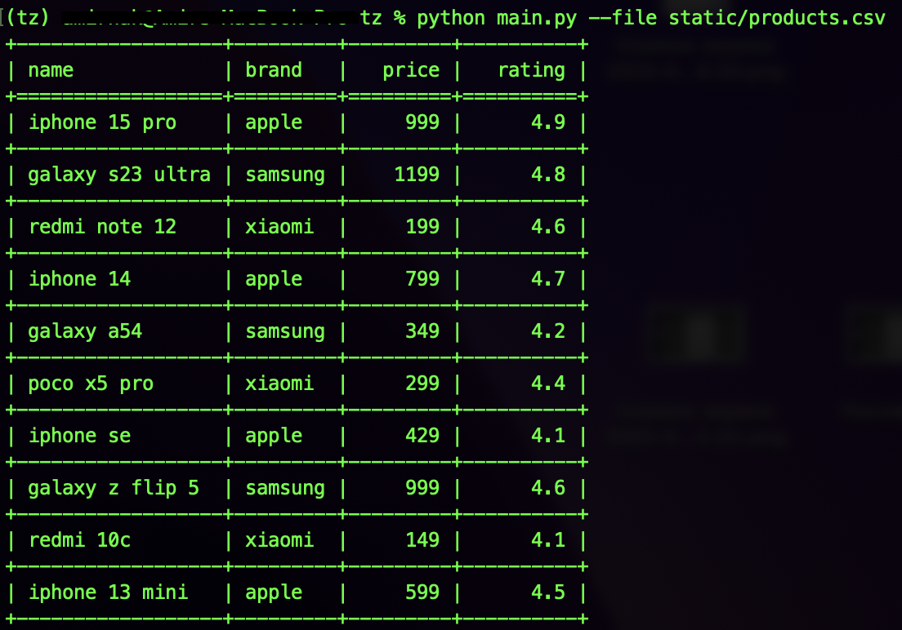
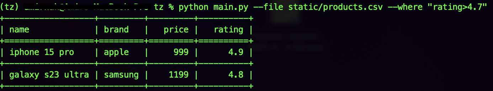
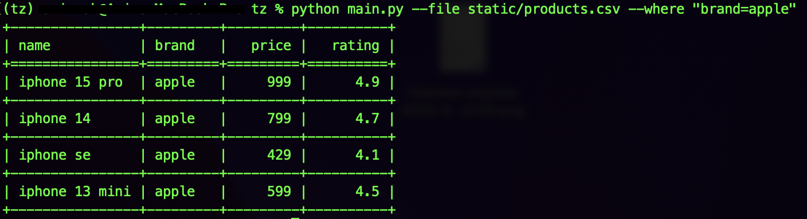
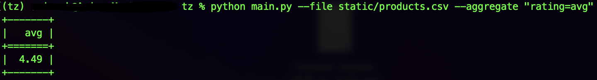
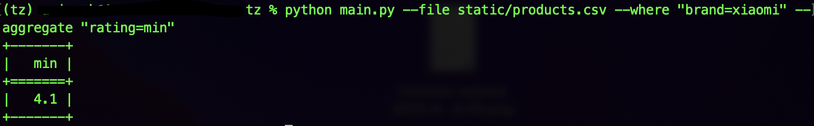

# CSV Processor

Скрипт для обработки CSV-файлов с поддержкой фильтрации и агрегации.

## Установка

Установка через pip:

```bash
pip install .
```

(Убедитесь, что у вас установлен pip>=21.3, чтобы он корректно читал pyproject.toml.)

Или можно установить через любой другой удобный вам пакетный менеджер

## Пример запуска

На данных изображениях представлены возможные запуски программы






## Поддерживаемые параметры

Посмотреть все параметры можно через:

```bash
python main.py --help
```

## Возможности

- Фильтрация (--where column>value, column<value, column=value, column<=value, column>=value)

- Агрегация (--aggregate column=avg|min|max)

- Поддержка текстовых и числовых колонок (агрегация — только по числовым)

- Вывод результатов в виде таблицы

## Тестирование

```bash
pytest
```

[©Amir Nakhushev](https://github.com/AmirNak07)
